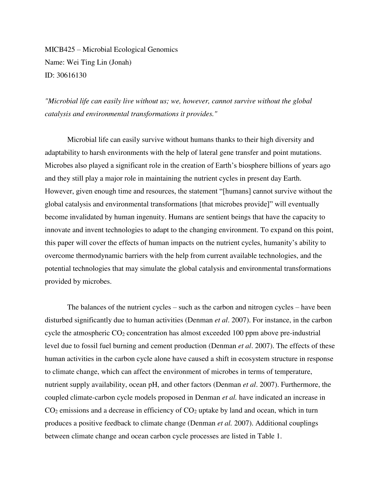
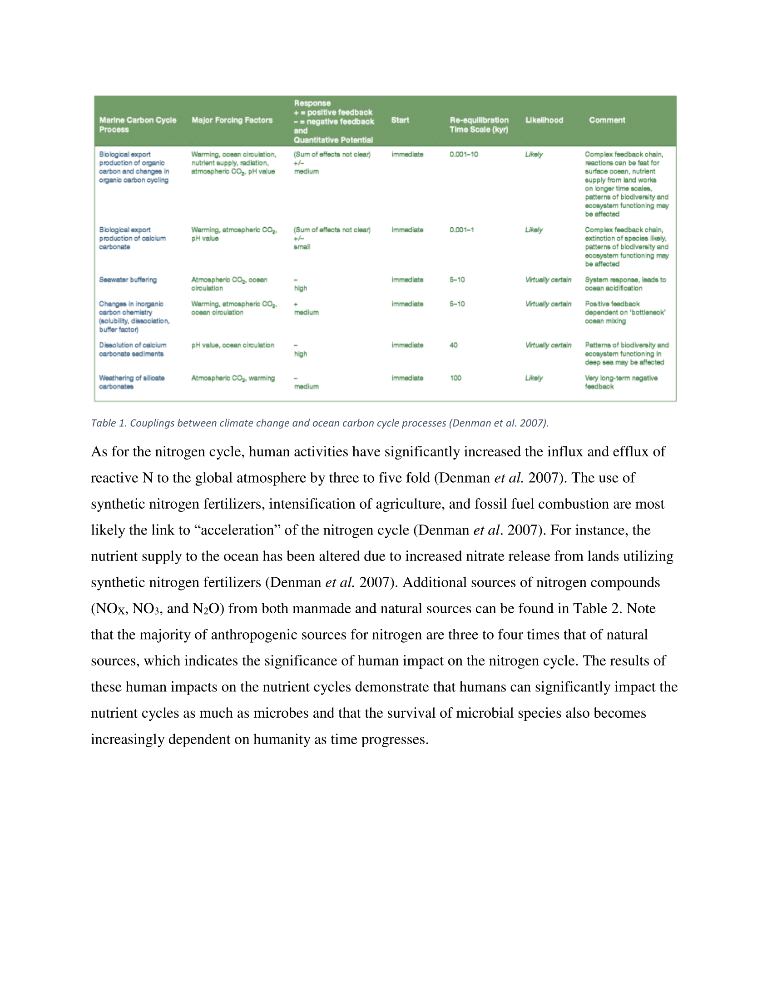
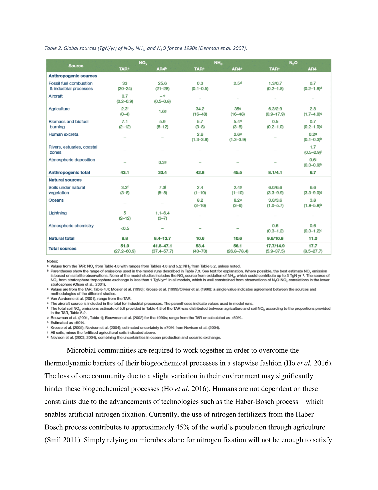
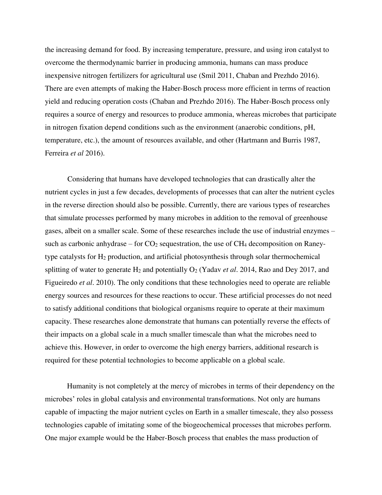
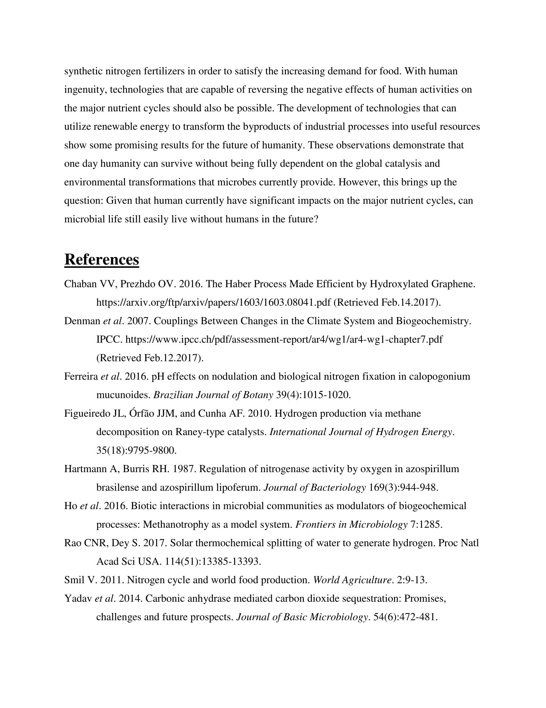

# Module 01
Reserve the first level headings (#) for the start of a new Module. This will help to organize your portfolio in an intuitive fashion.  
**Note: Please edit this template to your heart's content. This is meant to be the armature upon which you build your individual portfolio. You do not need to keep this instructive text in your final portfolio, although you do need to keep module and assignment names so we can identify what is what.**


## Module 01 Portfolio Check
The first of your second level headers (##) is to be used for the portfolio content checks. The Module 01 portfolio check has been built for you directly into this template, but will also be available as a stand-alone markdown document available on the MICB425 GitHub so that you know what is required in each module section in your portfolio. The completion status and comments will be filled in by the instructors during portfolio checks when your current portfolios are pulled from GitHub.

* Installation Check
    + Completion status:
    + Comments:
* Portfolio Repo Setup
    + Completion status: 
    + Comments:
* RMarkdown Pretty PDF Challenge
    + Completion status:
    + Comments:
* Evidence Worksheet_01
    + Completion status:
    + Comments:
* Evidence Worksheet_02
    + Completion status:
    + Comments:
* Evidence Worksheet_03
    + Completion status:
    + Comments:
* Problem Set_01
    + Completion status:
    + Comments:
* Problem Set_02
    + Completion status:
    + Comments:
* Writing Assessment_01
    + Completion status:
    + Comments:
* Additional Readings
    + Completion status:
    + Comments  
    
## Data science Friday  
The remaining second level headers (##) are for separating data science Friday, regular course, and project content. In this module, you will only need to include data science Friday and regular course content; projects will come later in the course.

### Installation check
Third level headers (###) should be used for links to assignments, evidence worksheets, problem sets, and readings, as seen here.  

Use this space to include your installation screenshots.


### Portfolio Repo Setup
Detail the code you used to create, initialize, and push your portfolio repo to GitHub. This will be helpful as you will need to repeat many of these steps to update your porfolio throughout the course.

git config --global user.name "Jonah Lin"

git config -- global user.email "1jonahlin1@gmail.com"

... Set up MICB425_Materials folder in relevant place ...

mkdir MICB425_Portfolio

cd MICB425_Portfolio

git init

git add .

git commit -m "State commit message here"

git remote add origin git@github.com:IStrykerI/MICB425_Portfolio.git

git remote -v

git push -u origin master

... Needed key to get to this repo since it's locked. Regular submit codes below ...

git add .

git commit -m "State commit message here"

git push

### Plotting Data in R

```{r child = "DS_Assignment_RPlotting.Rmd"}

```

### RMarkdown Pretty PDF Challenge
Paste your code from the in-class activity of recreating the example PDF.

```{r child = "DS_assignment3.Rmd"}

```

## Origins and Earth Systems
### Evidence Worksheet_01 "Prokaryotes: The Unseen Majority"
The template for the first Evidence Worksheet has been included here. The first thing for any assignment should link(s) to any relevant literature (which should be included as full citations in a module references section below).

You can copy-paste in the answers you recorded when working through the evidence worksheet into this portfolio template. 

As you include Evidence worksheets and Problem sets in the future, ensure that you delineate Questions/Learning Objectives/etc. by using headers that are 4th level and greater. This will still create header markings when you render (knit) the document, but will exclude these levels from the Table of Contents. That's a good thing. You don't' want to clutter the Table of Contents too much.

[Whitman *et al* 1998](https://www.ncbi.nlm.nih.gov/pmc/articles/PMC33863/)

#### Learning Objectives
Describe the numerical abundance of microbial life in relation to ecology and biogeochemistry of Earth systems. 

#### General Questions
* What were the main Questions being asked?  
    Main Questions:
    - What were the actual number of prokaryotes?
    - What was the total amount of their total cellular C on Earth?

* What were the primary methodological approaches used?  
    Primary Methodological Approaches: Usage of various papers for estimating the number of prokaryotes in various habitats, total C content (Mainly), turnover times, and cellular production rates   

* Summarize the main results or findings.  
    Summary of Main Results/Findings:
    - Total C of prokaryotes on earth is approx. 60-100% of total C found in plants
    - Prokaryotes also contain large amounts of N/P/Other essiential nutrients
    - Turnover rates are higher for surface prokaryotes than subsurface prokaryotes
    - Highest cellular productivity is found in open ocean (More mutations/rare genetic events are likely to occur)
    - Mutations = Major source of genetic diversity and essential to formation of novel species

* Do new Questions arise from the results?  
    New Questions:
    - More information is needed for subsurface prokaryotes
    - More detailed knowledge is needed regarding prokaryotic diversity

* Were there any specific challenges or advantages in understanding the paper (*e.g.* did the authors provide sufficient background information to understand experimental logic, were methods explained adequately, were any specific assumptions made, were conclusions justified based on the evidence, were the figures or tables useful and easy to understand)?  
    Specific Advantages:
    - Lots of tables with numbers for calculations (Approx. population in each primary habitats, total C contents in surface/subsurface prokaryotes and plants, turnover rates, simultaneous mutation rates, etc.)
    - Papers were logical for the most part when explaining their interpretations (Assumptions were also stated for the most part)
    Specific Challenges:
    - Some information regarding subsurface were only approximations or estimates (Data was derived at one site from only one study)
    - Some studies used logarithmic extrapolations rather than arithmetic averages (Could interfer with interpretation of results)
    - Grouping of prokaryotes into 3 primary habitats only (Ignoring other habitats such as in the air, leaves, animals, insects, etc.)
    

### Evidence Worksheet_02 "Life and the Evolution of Earth's Atmosphere"
#### Learning Objectives
Comment on the emergence of microbial life and the evolution of Earth systems
    
#### General Questions    
* Indicate the key events in the evolution of Earth systems at each approximate moment in the time series. If times need to be adjusted or added to the timeline to fully account for the development of Earth systems, please do so. 


    + 4.6 billion years ago  
        - Formation of solar system (Inner planets received water vapour and C)
    + 4.5 billion years ago  
        - Formation of moon (Gave Earth spin and tilt, day-night cycle, and seasons)
    + 4.2 billion years ago  
        - Meteorite Bombardment (Earth couldn't have been a permanent habitation)
    + 3.8 billion years ago  
        - Meteorite Bombardment Halted (Sea water chemistry stabilized)
        - Earliest sign that life began (Possibly existed via anoxygenic photosynthesis)
    + 3.75 billion years ago  
        - Early Methanogenesis
    + 3.5 billion years ago  
        - Presence of Rubisco (Implies global oxygenic photosynthesis)
        - Evolution of cyanobacteria
        - Presence of sulphate (Implies localized non-reducing conditions, but not necessarily the presence of O~2~)
    + 3.0 billion years ago  
        - Glaciation
        - Evidence of photosynthesis (Stromatolites from Cyanobacteria)
        - Presence of Cyanobacteria --> Emergence of Eukaryotes
    + 2.7 billion years ago  
        - Presence of hydrocarbon biomarkers and 2α-methylhopanes (Implies oxygenic photosynthesis from Cyanobacteria)
        - Presence of steranes (Implies presence of Eukaryotes)
    + 2.2 billion years ago  
        - Glaciation
        - Large increase in oxygen level (Microaerobic Early Atmosphere --> Oxic Air)
        - Existence of redbeds (Implies oxidation)
        - Apperance of complex eukaryotes may be involved in sharp increase in O~2~ level
        - Cellular cybernetic switch between mitochondria and chloroplasts may control the link between photosynthesis, CO~2~, and N fixations
    + 2.1 billion years ago
        - Evoltuion of multicellular life
    + 1.3 billion years ago
        - Evolution of Eukaryotes
    + 550,000 years ago  
        - Cambrian Explosion (Expansion of Multicellular Evolution)
        - Emergence of Land Plants (Increased oxygenation of atmosphere)
    + 400,000 years ago  
        - Emergence of Animals
    + 200,000 years ago  
        - Evolution of Homo sapiens


* Describe the dominant physical and chemical characteristics of Earth systems at the following waypoints:  


    + Hadean  
        - Physical = Mainly glacial surface (100^o^C and lower due to CO~2~ cooling) with intervals of hot, molten surface from meteorite impacts (500^o^C)
        - Chemical = Heavy CO~2~ and N~2~ atmospere with H~2~ and water vapour
    + Archean  
        - Physical = Heat flow was high due to radioactivity and decay (Powers plate tectonics and volcanism) followed by glaciation near the end of Eon
        - Chemical = Atmosphere lacked O~2~ and was mainly CH~4~:CO~2~ composition
    + Precambrian  
        - Physical = Collection of Earth's landmasses into a single supercontinent (Pangaea) with a number of glacial periods
        - Chemical = Atmosphere composition was mainly N~2~, CO~2~, and other inert gases (Atmosphere lacked O~2~ until emergence of photosynthetic life forms)
    + Proterozoic  
        - Physical = High tectonic activity that led to the formation of mountains and glaciation period
        - Chemical = Sharp increase in O~2~ from Cyanobacteria's oxygenic photosynthesis
    + Phanerozoic  
        - Physical = Global temperatures warm enough to support complex life
        - Chemical = Increased oxygenation of atmosphere due to emergence of land plants


### Problem Set_01
#### Learning Objectives: 
Describe the numerical abundance of microbial life in relation to the ecology and biogeochemistry of Earth systems.

#### Specific Questions:
* What are the primary prokaryotic habitats on Earth and how do they vary with respect to their capacity to support life? Provide a breakdown of total cell abundance for each primary habitat from the tables provided in the text.

  
    Primary Prokaryotic Habitats on Earth:  
    - Aquatic Environments = 1.2 * 10^29^ Cells  
    - Subsurface = 3.8 * 10^30^ Cells  
    - Soil = 2.6 * 10^29^ Cells

    How do they vary with respect to their capacity to support life:  
    Aquatic environments have the highest rate of cellular productivity while subsurface environments have the lowest rate of cellular productivity between the 3 habitats (Even though they have the highest population).


* What is the estimated prokaryotic cell abundance in the upper 200 m of the ocean and what fraction of this biomass is represented by marine cyanobacterium including Prochlorococcus? What is the significance of this ratio with respect to carbon cycling in the ocean and the atmospheric composition of the Earth?


    Estimated Prokaryotic Cell Abundance in Upper 200m of Ocean: 3.6 * 10^28^  
    Fraction represented by marine cyanobacterium (+ Prochlorococcus): (4 * 10^4^) / (5 * 10^5^) * 100 = 8%  
    Significance of this ratio with respect to C cycling in ocean and atmospheric composition of Earth:  
    Approx. 8% of these prokaryotes (Cyanobacteria + Prochlorococcus) are contributing to the conversion of CO~2~ to O~2~
    
    
* What is the difference between an autotroph, heterotroph, and a lithotroph based on information provided in the text?


    Difference Between Autotroph/Heterotroph/Lithotroph:
    - Autotroph = Photosynthetic, assimilate inorganic carbon (CO~2~ --> Biomass)
    - Heterotroph = Assimilate organic carbon
    - Lithotroph = Assimilate inorganic substrate  
    
    Based on information provided in text.
    
    
* Based on information provided in the text and your knowledge of geography what is the deepest habitat capable of supporting prokaryotic life? What is the primary limiting factor at this depth?  


    Deepest Habitat: 4 km (Terrestrial) and 10.9 - 14.9 km (Marine)  
    Primary Limiting Factor: Temperature (125^o^C)


* Based on information provided in the text your knowledge of geography what is the highest habitat capable of supporting prokaryotic life? What is the primary limiting factor at this height?  


    Highest Habitat: 77 km (In reality ~20 km above surface)  
    Primary Limiting Factor(s): Stable Space/Resources/Radiation/Lack of Moisture


* Based on estimates of prokaryotic habitat limitation, what is the vertical distance of the Earth’s biosphere measured in km?  
    
    
    Vertical Distance of Earth's Biosphere: ~24 - 44 km  


* How was annual cellular production of prokaryotes described in Table 7 column four determined? (Provide an example of the calculation)  
    
    
    Annual Cellular Production of Prokaryotes:  
    Population * (Turnover/Yr) = Cells/Yr  
    3.6 * 10^28^ * 365 Days/16 Turnovers = 8.2 * 10^29^ Cells/Yr  
    

* What is the relationship between carbon content, carbon assimilation efficiency and turnover rates in the upper 200m of the ocean? Why does this vary with depth in the ocean and between terrestrial and marine habitats?  
    
    
    Relationship between C content, C assimilation efficiency, and turnover rates in the upper 200m of ocean:  
    Due to the high turnover rates in the upper 200m of ocean and the estimated low C assimilation efficiency (0.2), the C content will be low since the majority of C will be used to support the turnover of prokaryotes and not assimilated.  
    This varies with depth in ocean and between terrestrial and marine habitats because as the depth increases, the turnover rate decreases due to low metabolic activity. This in turn leads to higher C contents since the turnover of prokaryotes in deeper depths becomes low enough for C to become assimilated.  
    


* How were the frequency numbers for four simultaneous mutations in shared genes determined for marine heterotrophs and marine autotrophs given an average mutation rate of 4 x 10^-7^ per DNA replication? (Provide an example of the calculation with units. Hint: cell and generation cancel out)  
    
    
    Frequency Number for 4 Simultaneous Mutations in Shared Genes:  
    Average Mutation Rate = 4 * 10^-7^ Per DNA Replication
    365 / 16 = 22.8 Turnovers/Yr   
    (4 * 10^-7^)^4^ = 2.56 * 10^-26^ Mutations/Generation  
    3.6 * 10^28^ Cells * 22.8 = 8.2 * 10^29^ Cells/Yr * 2.56 * 10^-26^ Mutatations/Generation = 2.1 * 10^4^ Mutations/Yr


* Given the large population size and high mutation rate of prokaryotic cells, what are the implications with respect to genetic diversity and adaptive potential? Are point mutations the only way in which microbial genomes diversify and adapt?  
    
    
    Implications:
    - Higher genetic diversity due to high mutation rate 
    - Higher adaptive potential to environment due to high mutation rate (Natural selection of prokaryotic cells - Favours ones that contain mutation to help with survival)  
    
    No: Point mutations are not the only way in which microbial genomes diversify and adapt. There can also be HGT between other bacteria, different levels of gene regulation/expression, insertions/deletions, etc.  
    

* What relationships can be inferred between prokaryotic abundance, diversity, and metabolic potential based on the information provided in the text?
    
    
    Relationships Between Prokaryotic Abundance, Diversity, and Metabolic Potential:
    High Prokaryotic Abundance <--> Higher Diversity <--> Higher Metabolic Potentials (More prokaryotes will lead to higher diversity via mutations and mutations could contribute to better genes that help with metabolism)  
    

### Problem Set_02
#### Learning Objectives:
Discuss the role of microbial diversity and formation of coupled metabolism in driving global biogeochemical cycles.

#### Specific Questions:
* What are the primary geophysical and biogeochemical processes that create and sustain conditions for life on Earth? How do abiotic versus biotic processes vary with respect to matter and energy transformation and how are they interconnected?
    
    
    Primary Geophysical Processes = Tectonics and atmospheric photocehmical processes
    Primary Biogeochemical Processes = Microbially catalyzed, thermodynamically constrained redox reactions
    Abiotic vs. Biotic Processes vary with respect to matter/energy transformation and how are they interconnected:
    Abiotic processes usually supplies biotic processes with substrates (Biotic processes uses up energy to sustain life and uses up matter to produce "waste products" whereas abiotic processes creates energy via transformation of "waste products" to substrates usable by microbes)


* Why is Earth’s redox state considered an emergent property?
    
    
    Earth's Redox State = Emergent Property of Microbial Life on Planetary Scale
    - First 5 elements (C/H/N/O/S) driven largely by microbially catalyzed, thermodynamically constrained redox reactions
    - C/S/P dependent on tectonics (Volcanism/Rock Weathering)
    - Biogeochemical cycles evolved on planetary scale to form set of nested abiotically driven acid-base and biologically driven redox reactions (Sets lower limits on external energy required to sustain cycles)
    - Feedbacks between evolution of microbial metabolic geochemical processes create average redox conditions of oceans/atmosphere
    - Biological Oxidation = Driven by photosynthesis


* How do reversible electron transfer reactions give rise to element and nutrient cycles at different ecological scales? What strategies do microbes use to overcome thermodynamic barriers to reversible electron flow?  
    
    
    Reversible electron transfer reactions --> Element + Nutrient Cycles at different ecological scales?
    Steps:
    1) Energy of light from photosynthesis oxidizes electron donor
    2) The electrons + protons generated in the process are used to reduce inorganic C to organic matter with higher energy bonds
    3) Resulting oxidizing metabolites may serve as electron acceptors in aerobic or anaerobic respiration for photosynthetic organisms that use these "waste products" as oxidants
    4) Nutrients may be buried in sediments and returned to biosphere via mountain building and subsequent erosion/geothermal activity
    Strategies used by microbes to overcome thermodynamic barriers to reversible electron flow:
    - Reduction of CO~2~ with H~2~ (If H tension is sufficiently low, the reversible process becomes thermodynamically favorable). This may require the help of multispecies assemblages (H-Consuming sulfate reducers). Uses differences in concentration of substrates for overcoming thermodynamic barriers
    - Citric acid cycle oxidizes acetate stepwise into CO~2~. Breaking down elements in stepwise fashion uses less energy than breaking down elements directly into its most basic elements
    - Use of enzyme in converting N~2~ to NH~4~^+^. Enzymes reduces energy required to overcome thermodynamic barriers
    - Microbes work together in communities to overcome thermodynamic barriers. Uses products of other microbe population as substrates
    

* Using information provided in the text, describe how the nitrogen cycle partitions between different redox “niches” and microbial groups. Is there a relationship between the nitrogen cycle and climate change?
    
    
    N Cycle
    - N Fixation transforms N~2~ to NH~4~^+^ for use in synthesis of proteins and nucleic acids (Requires mechanism for protecting enzyme from oxygen by spatially or temporally segregating nitrogen fixation from aerobic environments)
    - Oxidation of ammonia to hydroxylamine via ammonia monooxygenase
    Relationship between N cycle and climate change:
    - Syntheic N from fertilizers lead to excess N in N cycle
    - Excess N may lead to algae blooms (Nutrient enrichment and warm waters)
    - Excess N may affect denitrification process in freshwater (Influx of N > Efflux of N)


* What is the relationship between microbial diversity and metabolic diversity and how does this relate to the discovery of new protein families from microbial community genomes?
    
    
    Relationship between microbial diversity and metabolic diversity:
    Higher microbial diversity leads to higher metabolic diversity since different microbes may have a better chance of survival under different conditions using a different resource for metabolism (High metabolic diversity)
    Relation to discovery of new protein families from microbial community genomes:
    Microbial communities with high diversity (In terms of species and metabolic diversity) will have a higher chance of finding new protein families due to mutations creating more efficient or functionally different proteins in microbes.


* On what basis do the authors consider microbes the guardians of metabolism?
    
    
    Microbes = Guardians of Metabolism
    - Dispersal of core planetary gene set (VGT/HGT)
    - Selective pressure leads to evolution of boutique genes that protect metabolic pathway (Enables retention of fundamental redox processes using microbes as vessels)


### Module 01 Writing







### Module 01 References
Utilize this space to include a bibliography of any literature you want associated with this module. We recommend keeping this as the final header under each module.

An example for Whitman and Wiebe (1998) has been included below.

Whitman WB, Coleman DC, and Wiebe WJ. 1998. Prokaryotes: The Unseen Majority. Proc Natl Acad Sci USA. 95(12):6578–6583.  [PMC33863](https://www.ncbi.nlm.nih.gov/pmc/articles/PMC33863/)

Falkowski PG, et al. 2009. The Microbial Engines That Drive Earth's Biogeochemical Cycles. Science. 320(5879):1034-1039.
[JSTOR20054782](http://www.jstor.org.ezproxy.library.ubc.ca/stable/20054782)

Suddick EC, Whitney P, Townsend AR, and Davidson EA. 2013. The role of nitrogen in climate change and the impacts of nitrogen–climate interactions in the United States: foreword to thematic issue. Biogeochemistry. 114(3):1-10.
[1573-515X](https://link.springer.com/article/10.1007/s10533-012-9795-z)
