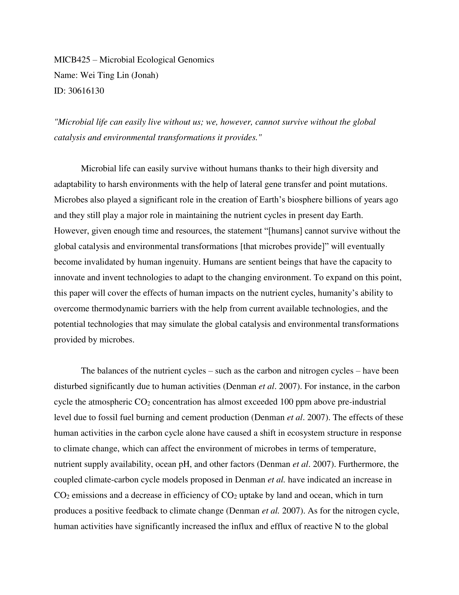
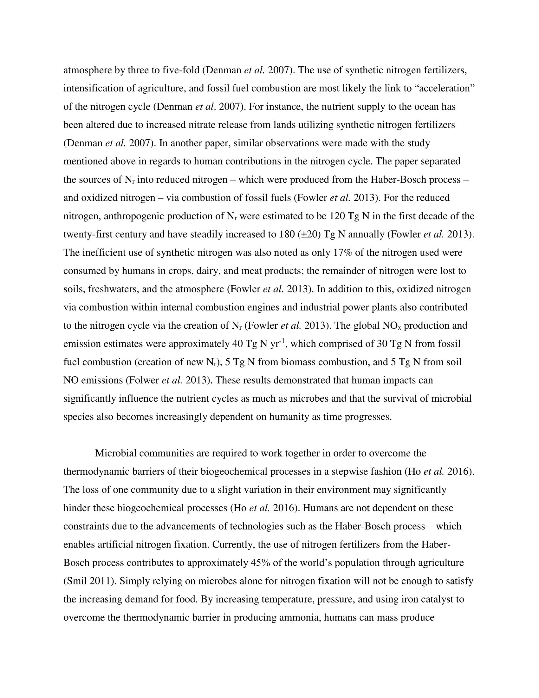
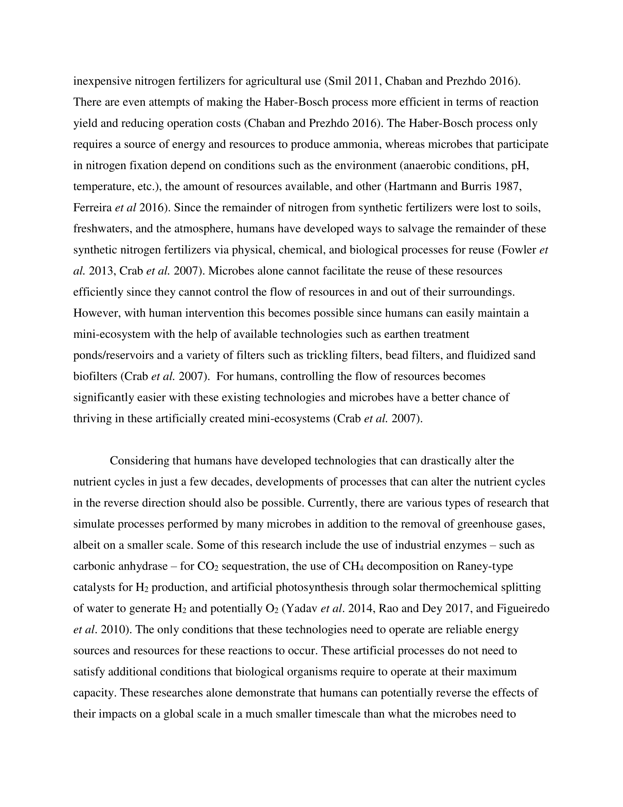
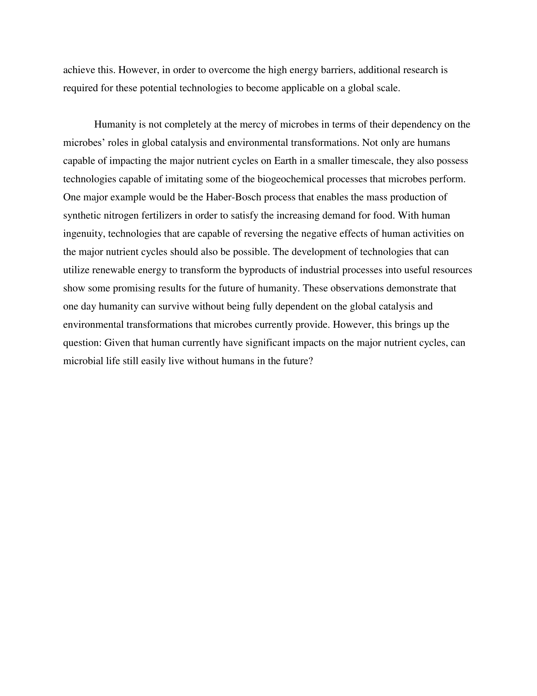

# Portfolio Notes

- Pretty PDF Challenge adjusted to match format of entire portfolio

- Refer to File_Fragments folder for individual files used to knit this portfolio

- Currently uses R version 3.4.4

- Project 1+2 are included in portfolio using html iframe, if it is displaying weirdly, please refer to the original files (Listed in the 2 points below)

- Project 1: Refer to main.html in MICB425_Project1 folder for the original files 

- Project 2: Refer to main.html in MICB425_Project2 folder for the original files

- For final tree outputs from Project 2, please refer to the folder in MICB425_Project2/final_trees for both DNA and RNA trees

# Portfolio Check

## Module 01 Portfolio Content

* Evidence worksheet_01
    + Completion status: X
    + Comments:
* Evidence worksheet_02
    + Completion status: X
    + Comments:
* Evidence worksheet_03
    + Completion status: X
    + Comments:
* Problem Set_01
    + Completion status: X
    + Comments:
* Problem Set_02
    + Completion status: X
    + Comments:
* Writing assessment_01
    + Completion status: X
    + Comments:
* Additional Readings
    + Completion status: X
    + Comments  

### Data Science

* Installation check
    + Completion status: X
    + Comments:
* Portfolio repo setup
    + Completion status: X
    + Comments:
* RMarkdown Pretty PDF Challenge
    + Completion status: X
    + Comments: I would pat that dog.
* ggplot
    + Completion status: 9+0.5/10
    + Comments:

## Module 02 Portfolio Content

* Evidence worksheet_04
    + Completion status: X
    + Comments:
* Problem Set_03
    + Completion status: X
    + Comments:
* Writing assessment_02
    + CANCELED
* Additional Readings
    + Completion status: X
    + Comments 
    
## Module 03 Portfolio Content

* Evidence worksheet_05
    + Completion status: X
    + Comments:
* Problem set_04
    + Completion status: X
    + Comments:
* Writing Assessment_03
    + Completion status:
    + Comments:
* Additional Readings
    + Completion status:
    + Comments 
    
### Project 1

* CATME account setup and survey
    + Completion status: X
    + Comments: 
* CATME interim group assessment
    + Completion status: X
    + Comments:
* Project 1
    + Report (80%): Looking good!
    + Participation (20%):
    
## Module 04 Portfolio Content
### Project 2

* CATME final group assessment
    + Completion status: 
    + Comments:
* Project 2
    + Report (80%): 
    + Participation (20%):

# Module 01

## Data science Friday  

### Installation check


### Portfolio Repo Setup
Detail the code you used to create, initialize, and push your portfolio repo to GitHub. This will be helpful as you will need to repeat many of these steps to update your porfolio throughout the course.

```{r child = "File_Fragments/Repo_Setup.Rmd"}

```

### Plotting Data in R

```{r child = "File_Fragments/R_Plotting.Rmd"}

```

### RMarkdown Pretty PDF Challenge
Paste your code from the in-class activity of recreating the example PDF.

```{r child = "File_Fragments/Pretty_PDF_Challenge.Rmd"}

```

## Origins and Earth Systems
### Evidence Worksheet_01 "Prokaryotes: The Unseen Majority"

```{r child = "File_Fragments/Evidence_Worksheet_1-1.Rmd"}

```

### Evidence Worksheet_02 "Life and the Evolution of Earth's Atmosphere"

```{r child = "File_Fragments/Evidence_Worksheet_1-2.Rmd"}

```

### Evidence Worksheet_03 "The Anthropocene"

```{r child = "File_Fragments/Evidence_Worksheet_1-3.Rmd"}

```

### Problem Set_01

```{r child = "File_Fragments/Problem_Set_1-1.Rmd"}

```

### Problem Set_02

```{r child = "File_Fragments/Problem_Set_1-2.Rmd"}

```

### Module 01 Writing







### Module 01 References

Achenbach J. 2012. Spaceship Earth: A new view of environmentalism. The Washington Post. 
[Link](https://www.washingtonpost.com/national/health-science/spaceship-earth-a-new-view-of-environmentalism/2011/12/29/gIQAZhH6WP_story.html?utm_term=.47de191a6383)

Canfield DE, Glazer AN, Falkowski PG. 2010. The Evolution and Future of Earth's Nitrogen Cycle. Science. 330:192-196.
[Link](http://www.jstor.org.ezproxy.library.ubc.ca/stable/40931809)

Falkowski PG, et al. 2009. The Microbial Engines That Drive Earth's Biogeochemical Cycles. Science. 320(5879):1034-1039.
[Link](http://www.jstor.org.ezproxy.library.ubc.ca/stable/20054782)

Kasting JF, Siefert JL. 2002. Life and the Evolution of Earth's Atmosphere. Science. 296:1066-1068.
[Link](http://www.jstor.org.ezproxy.library.ubc.ca/stable/3076692)

Leopold A, Schwartz CW. 1949. A Sand Country Almanac: With Other Essays on Conservation from Round River. Enl. ed.
[N/A]()

Nisbet EG, Sleep NH. 2001. The habitat and nature of early life. Nature. 409(6823):1083-1091.
[N/A]()

Rockstr?m J, Steffen W, Noone K, Scheffer M, Teknik- och vetenskapshistoria (bytt namn 20120201), Skolan f?r arkitektur och samh?llsbyggnad (ABE), KTH, Filosofi och teknikhistoria. 2009. A safe operating space for humanity. Nature. 461(7263):472-475.
[N/A]()

Schrag DP. 2012. Geobiology of the Anthropocene. Fundamentals of Geobiology. Chapter 22.
[Link](https://doi.org/10.1002/9781118280874.ch22)

Suddick EC, Whitney P, Townsend AR, and Davidson EA. 2013. The role of nitrogen in climate change and the impacts of nitrogen-climate interactions in the United States: foreword to thematic issue. Biogeochemistry. 114(3):1-10.
[Link](https://link.springer.com/article/10.1007/s10533-012-9795-z)

Whitman WB, Coleman DC, and Wiebe WJ. 1998. Prokaryotes: The Unseen Majority. Proc Natl Acad Sci USA. 95(12):6578-6583.  [PMC33863](https://www.ncbi.nlm.nih.gov/pmc/articles/PMC33863/)

Zehnder AJB. 1988. Biology of anaerobic microorganisms. Research in Microbiology. Chapter 1.
[Link](https://doi.org/10.1016/0923-2508(89)90030-2)

# Module 02

## Remapping the Body of the World

### Evidence worksheet_04 "Bacterial Rhodopsin Gene Expression"

```{r child = "File_Fragments/Evidence_Worksheet_2-4.Rmd"}

```

### Problem Set_03

```{r child = "File_Fragments/Problem_Set_2-3.Rmd"}

```

### Module 02 References

Madsen EL. 2005. Identifying microorganisms responsible for ecologically significant biogeochemical processes. Nature Reviews Microbiology. 3:439-446.
[PMID15864265](https://www.ncbi.nlm.nih.gov/pubmed/15864265)

Martinez A, Bradley AS, Waldbauer JR, Summons RE, DeLong EF. 2007. Proteorhodopsin Photosystem Gene Expression Enables Photophosphorylation in a Heterologous Host. Proceedings of the National Academy of Sciences of the United States of America. 104:5590-5595.
[Link](http://www.jstor.org/stable/25427240)

Wooley J, Godzik A, Friedberg I. 2010. A Primer on Metagenomics. PLOS COMPUTATIONAL BIOLOGY. 6:e1000667.
[Link](https://doi.org/10.1371/journal.pcbi.1000667)

# Module 03

### Evidence worksheet_05 "Extensive mosaic structure of uropathogenic E. coli"

```{r child = "File_Fragments/Evidence_Worksheet_3-5.Rmd"}

```

### Problem set_04

```{r child = "File_Fragments/Problem_Set_3-4.Rmd"}

```

### Module 03 Writing


### Module 03 References

Callahan BJ, Mcmurdie PJ, Holmes SP. 2017. Exact sequence variants should replace operational taxonomic units in marker-gene data analysis. The ISME Journal. 11:2639.
[Link](https://www.ncbi.nlm.nih.gov/pmc/articles/PMC5702726/)

Gaudet AD, Ramer LM, Nakonechny J, Cragg JJ, Ramer MS. 2010. Small-group learning in an upper-level university biology class enhances academic performance and student attitudes toward group work. PloS one. 5:e15821.
[Link](http://journals.plos.org/plosone/article?id=10.1371/journal.pone.0015821)

Hallam SJ, Torres-beltr√°n M, Hawley AK. 2017. Monitoring microbial responses to ocean deoxygenation in a model oxygen minimum zone. Scientific Data. 4:170158.
[Link](https://www.nature.com/articles/sdata2017158.pdf)

Hawley AK, Torres-beltr√°n M, Zaikova E, et al. 2017. A compendium of multi-omic sequence information from the Saanich Inlet water column. Scientific Data. 4:170160.
[Link](https://www.nature.com/articles/sdata2017160.pdf)

Kunin V, Engelbrektson A, Ochman H, Hugenholtz P. 2010. Wrinkles in the rare biosphere: pyrosequencing errors can lead to artificial inflation of diversity estimates. Environmental microbiology. 12:118-123.
[Link](https://www.ncbi.nlm.nih.gov/pubmed/19725865)

Sogin ML, Morrison HG, Huber JA, et al. 2006. Microbial Diversity in the Deep Sea and the Underexplored "Rare Biosphere". Proceedings of the National Academy of Sciences of the United States of America. 103:12115-12120.
[Link](http://www.pnas.org/content/103/32/12115)

Torres-Beltr·n M, Hawley AK, Capelle D, et al. 2017. A compendium of geochemical information from the Saanich Inlet water column. Scientific Data. 4:170159.
[Link](https://www.nature.com/articles/sdata2017159.pdf)

Welch RA, Burland V, Plunkett G, et al. 2002. Extensive Mosaic Structure Revealed by the Complete Genome Sequence of Uropathogenic Escherichia coli. Proceedings of the National Academy of Sciences of the United States of America. 99:17020-17024.
[Link](https://www.ncbi.nlm.nih.gov/pmc/articles/PMC139262/)

### Project 1
"Module 3: Project 1 by Team 5"  
"Mothur vs. QIIME2 Microbiome Data Analysis"  
Authors:  
  - Karl Abuan  
  - May Ho  
  - Jonah Lin  
  - Leilynaz Malekafzali  
  - Tiffany Yang  
  - Abdur Rahman M. A. Basher  


```{r, echo=FALSE}
htmltools::tags$iframe(title="MICB425 Project 1", src="MICB425_Project1/main.html", height=1000, width=1000)
```

### Project 2

```{r, echo=FALSE}
htmltools::tags$iframe(title="MICB425 Project 2", src="MICB425_Project2/main.html", height=1000, width=1000)
```