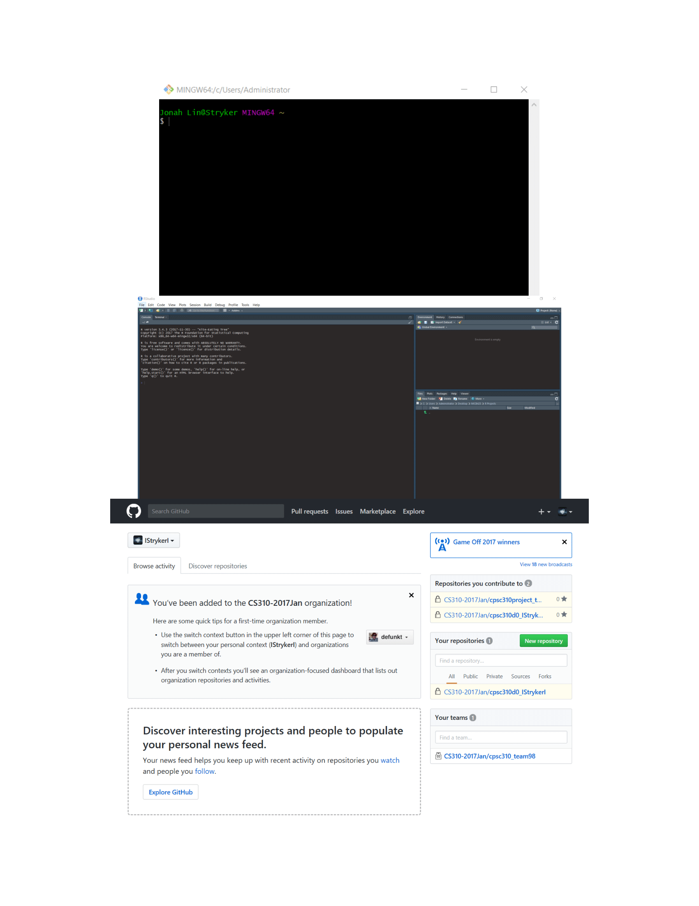
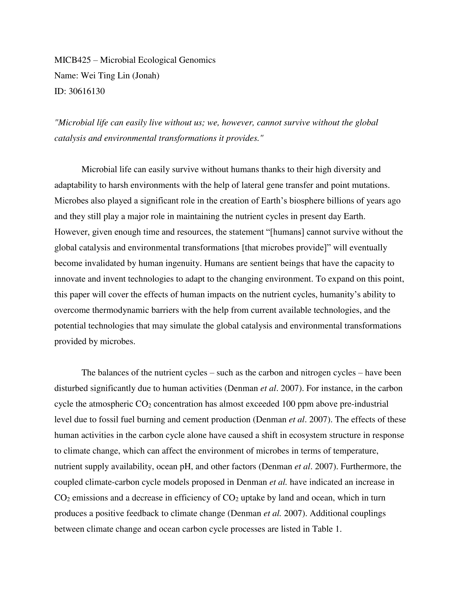
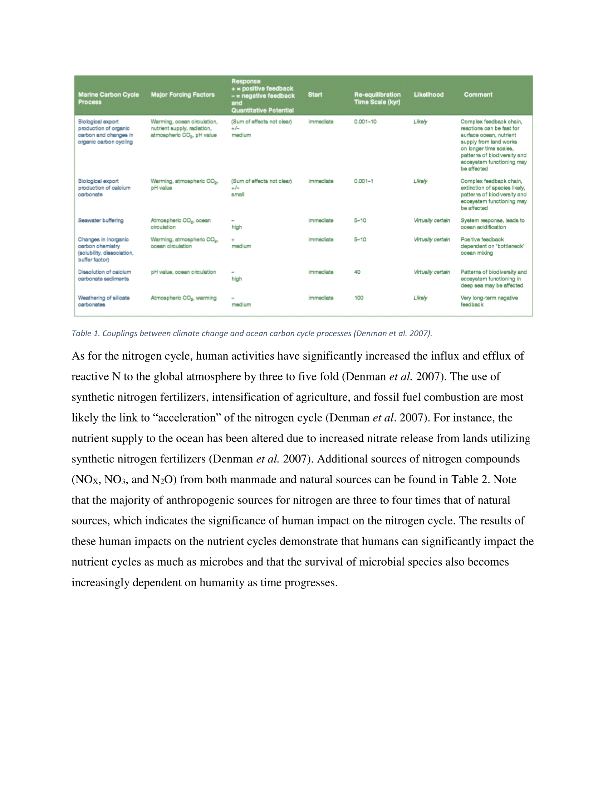
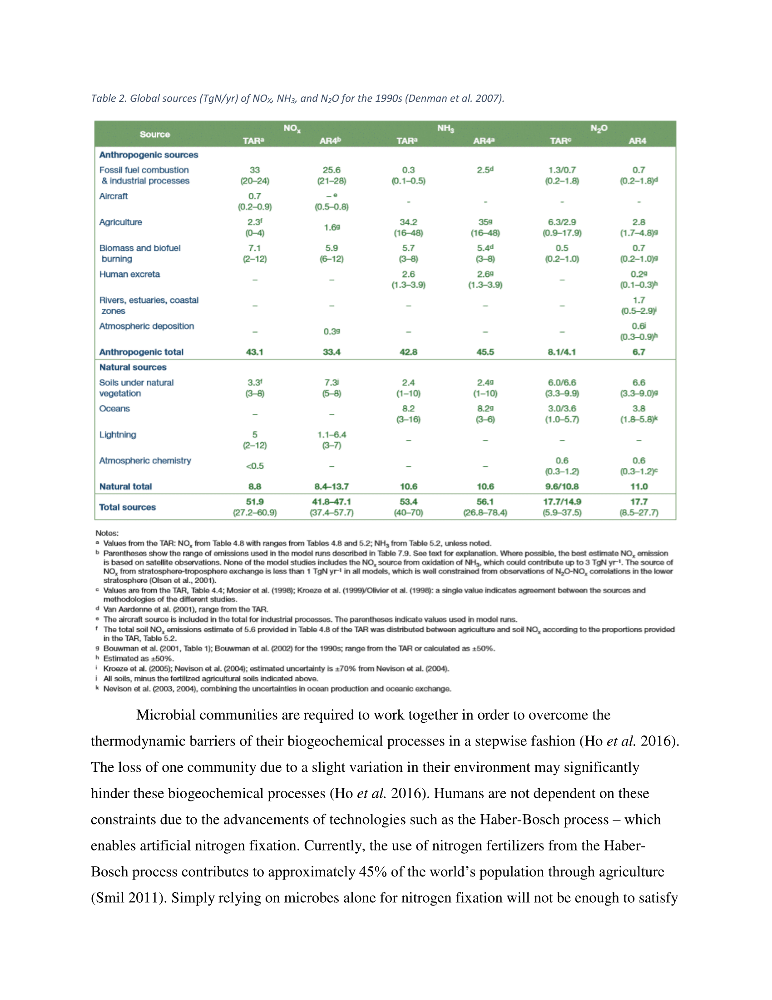
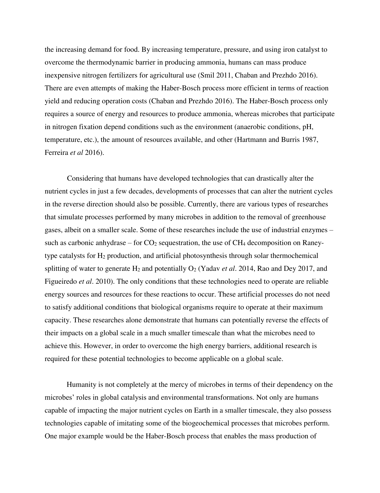
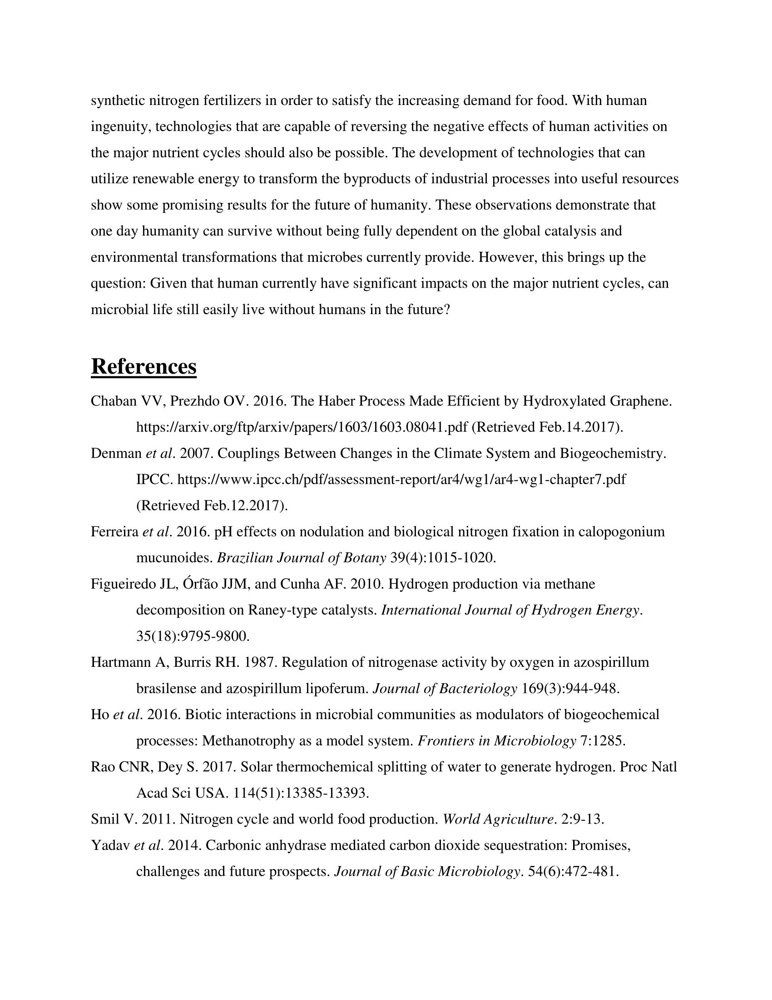

# Portfolio Notes

- Pretty PDF Challenge adjusted to match format of entire portfolio

- Refer to File_Fragments folder for individual files used to knit this portfolio

# Portfolio Check

## Module 01 Portfolio Content

* Evidence worksheet_01
    + Completion status: X
    + Comments:
* Evidence worksheet_02
    + Completion status: X
    + Comments:
* Evidence worksheet_03
    + Completion status:
    + Comments:
* Problem Set_01
    + Completion status: X
    + Comments:
* Problem Set_02
    + Completion status: X
    + Comments:
* Writing assessment_01
    + Completion status:
    + Comments:
* Additional Readings
    + Completion status:
    + Comments  

### Data Science

* Installation check
    + Completion status: X
    + Comments:
* Portfolio repo setup
    + Completion status: X
    + Comments:
* RMarkdown Pretty PDF Challenge
    + Completion status: X
    + Comments: I would pat that dog.
* ggplot
    + Completion status: 9/10
    + Comments: Exercise 3 should be at a different taxonomic level than the example plot. 

## Module 02 Portfolio Content

* Evidence worksheet_04
    + Completion status:
    + Comments:
* Problem Set_03
    + Completion status:
    + Comments:
* Writing assessment_02
    + CANCELED
* Additional Readings
    + Completion status:
    + Comments 
    
## Module 03 Portfolio Content

* Evidence worksheet_05
    + Completion status:
    + Comments:
* Problem set_04
    + Completion status:
    + Comments:
* Writing Assessment_03
    + Completion status:
    + Comments:
* Additional Readings
    + Completion status:
    + Comments 
    
### Project 1

* CATME account setup and survey
    + Completion status: 
    + Comments: 
* CATME interim group assessment
    + Completion status: 
    + Comments:
* Project 1
    + Report (80%): 
    + Participation (20%):
    
## Module 04 Portfolio Content
### Project 2

* CATME final group assessment
    + Completion status: 
    + Comments:
* Project 2
    + Report (80%): 
    + Participation (20%):

# Module 01

## Data science Friday  

### Installation check



### Portfolio Repo Setup
Detail the code you used to create, initialize, and push your portfolio repo to GitHub. This will be helpful as you will need to repeat many of these steps to update your porfolio throughout the course.

```{r child = "File_Fragments/Repo_Setup.Rmd"}

```

### Plotting Data in R

```{r child = "File_Fragments/R_Plotting.Rmd"}

```

### RMarkdown Pretty PDF Challenge
Paste your code from the in-class activity of recreating the example PDF.

```{r child = "File_Fragments/Pretty_PDF_Challenge.Rmd"}

```

## Origins and Earth Systems
### Evidence Worksheet_01 "Prokaryotes: The Unseen Majority"

[Whitman *et al* 1998](https://www.ncbi.nlm.nih.gov/pmc/articles/PMC33863/)

```{r child = "File_Fragments/Evidence_Worksheet_1-1.Rmd"}

```

### Evidence Worksheet_02 "Life and the Evolution of Earth's Atmosphere"

```{r child = "File_Fragments/Evidence_Worksheet_1-2.Rmd"}

```

### Evidence Worksheet_03 "The Anthropocene"

### Problem Set_01

```{r child = "File_Fragments/Problem_Set_1-1.Rmd"}

```

### Problem Set_02

```{r child = "File_Fragments/Problem_Set_1-2.Rmd"}

```

### Module 01 Writing







### Module 01 References

Achenbach J. 2012. Spaceship Earth: A new view of environmentalism. The Washington Post. 
[Link](https://www.washingtonpost.com/national/health-science/spaceship-earth-a-new-view-of-environmentalism/2011/12/29/gIQAZhH6WP_story.html?utm_term=.47de191a6383)

Canfield DE, Glazer AN, Falkowski PG. 2010. The Evolution and Future of Earth's Nitrogen Cycle. Science. 330:192-196.
[Link](http://www.jstor.org.ezproxy.library.ubc.ca/stable/40931809)

Falkowski PG, et al. 2009. The Microbial Engines That Drive Earth's Biogeochemical Cycles. Science. 320(5879):1034-1039.
[Link](http://www.jstor.org.ezproxy.library.ubc.ca/stable/20054782)

Kasting JF, Siefert JL. 2002. Life and the Evolution of Earth's Atmosphere. Science. 296:1066-1068.
[Link](http://www.jstor.org.ezproxy.library.ubc.ca/stable/3076692)

Leopold A, Schwartz CW. 1949. A Sand Country Almanac: With Other Essays on Conservation from Round River. Enl. ed.
[N/A]()

Nisbet EG, Sleep NH. 2001. The habitat and nature of early life. Nature. 409(6823):1083-1091.
[N/A]()

Rockström J, Steffen W, Noone K, Scheffer M, Teknik- och vetenskapshistoria (bytt namn 20120201), Skolan för arkitektur och samhällsbyggnad (ABE), KTH, Filosofi och teknikhistoria. 2009. A safe operating space for humanity. Nature. 461(7263):472-475.
[N/A]()

Schrag DP. 2012. Geobiology of the Anthropocene. Chapter 22.
[Link](https://doi.org/10.1002/9781118280874.ch22)

Suddick EC, Whitney P, Townsend AR, and Davidson EA. 2013. The role of nitrogen in climate change and the impacts of nitrogen-climate interactions in the United States: foreword to thematic issue. Biogeochemistry. 114(3):1-10.
[Link](https://link.springer.com/article/10.1007/s10533-012-9795-z)

Whitman WB, Coleman DC, and Wiebe WJ. 1998. Prokaryotes: The Unseen Majority. Proc Natl Acad Sci USA. 95(12):6578-6583.  [PMC33863](https://www.ncbi.nlm.nih.gov/pmc/articles/PMC33863/)

Zehnder AJB. 1988. Biology of anaerobic microorganisms. Research in Microbiology. Chapter 1.
[Link](https://doi.org/10.1016/0923-2508(89)90030-2)

# Module 02

## Remapping the Body of the World

### Evidence worksheet_04 "Bacterial Rhodopsin Gene Expression"

```{r child = "File_Fragments/Evidence_Worksheet_2-4.Rmd"}

```

### Module 02 References

### Problem Set_03

```{r child = "File_Fragments/Problem_Set_2-3.Rmd"}

```

# Module 03

### Evidence worksheet_05

### Problem set_04

```{r child = "File_Fragments/Problem_Set_3-4.Rmd"}

```

### Module 03 Writing

### Module 03 References