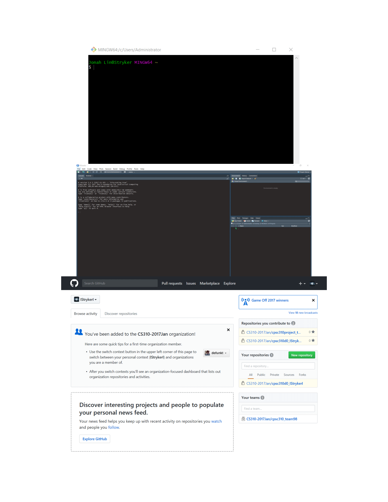

# Module 01
Reserve the first level headings (#) for the start of a new Module. This will help to organize your portfolio in an intuitive fashion.  
**Note: Please edit this template to your heart's content. This is meant to be the armature upon which you build your individual portfolio. You do not need to keep this instructive text in your final portfolio, although you do need to keep module and assignment names so we can identify what is what.**


## Module 01 portfolio check
The first of your second level headers (##) is to be used for the portfolio content checks. The Module 01 portfolio check has been built for you directly into this template, but will also be available as a stand-alone markdown document available on the MICB425 GitHub so that you know what is required in each module section in your portfolio. The completion status and comments will be filled in by the instructors during portfolio checks when your current portfolios are pulled from GitHub.

* Installation check
    + Completion status:
    + Comments:
* Portfolio repo setup
    + Completion status: 
    + Comments:
* RMarkdown Pretty PDF Challenge
    + Completion status:
    + Comments:
* Evidence worksheet_01
    + Completion status:
    + Comments:
* Evidence worksheet_02
    + Completion status:
    + Comments:
* Evidence worksheet_03
    + Completion status:
    + Comments:
* Problem Set_01
    + Completion status:
    + Comments:
* Problem Set_02
    + Completion status:
    + Comments:
* Writing assessment_01
    + Completion status:
    + Comments:
* Additional Readings
    + Completion status:
    + Comments  
    
## Data science Friday  
The remaining second level headers (##) are for separating data science Friday, regular course, and project content. In this module, you will only need to include data science Friday and regular course content; projects will come later in the course.

### Installation check
Third level headers (###) should be used for links to assignments, evidence worksheets, problem sets, and readings, as seen here.  

Use this space to include your installation screenshots.



### Portfolio repo setup
Detail the code you used to create, initialize, and push your portfolio repo to GitHub. This will be helpful as you will need to repeat many of these steps to update your porfolio throughout the course.

git config --global user.name "Jonah Lin"

git config -- global user.email "1jonahlin1@gmail.com"

... Set up MICB425_Materials folder in relevant place ...

mkdir MICB425_Portfolio

cd MICB425_Portfolio

git init

git add .

git commit -m "State commit message here"

git remote add origin git@github.com:IStrykerI/MICB425_Portfolio.git

git remote -v

git push -u origin master

... Needed key to get to this repo since it's locked. Regular submit codes below ...

git add .

git commit -m "State commit message here"

git push

### RMarkdown pretty PDF challenge
Paste your code from the in-class activity of recreating the example PDF.

```{r child = "DS_assignment3.Rmd"}

```

## Origins and Earth Systems
### Evidence worksheet 01 
The template for the first Evidence Worksheet has been included here. The first thing for any assignment should link(s) to any relevant literature (which should be included as full citations in a module references section below).

You can copy-paste in the answers you recorded when working through the evidence worksheet into this portfolio template. 

As you include Evidence worksheets and Problem sets in the future, ensure that you delineate Questions/Learning Objectives/etc. by using headers that are 4th level and greater. This will still create header markings when you render (knit) the document, but will exclude these levels from the Table of Contents. That's a good thing. You don't' want to clutter the Table of Contents too much.

[Whitman *et al* 1998](https://www.ncbi.nlm.nih.gov/pmc/articles/PMC33863/)

#### Learning objectives
Describe the numerical abundance of microbial life in relation to ecology and biogeochemistry of Earth systems. 

#### General questions
* What were the main questions being asked?  

* What were the primary methodological approaches used?  

* Summarize the main results or findings.  

* Do new questions arise from the results?  

* Were there any specific challenges or advantages in understanding the paper (*e.g.* did the authors provide sufficient background information to understand experimental logic, were methods explained adequately, were any specific assumptions made, were conclusions justified based on the evidence, were the figures or tables useful and easy to understand)?  


### Problem set 01
#### Learning objectives: 
Describe the numerical abundance of microbial life in relation to the ecology and biogeochemistry of Earth systems.

#### Specific questions:
* What are the primary prokaryotic habitats on Earth and how do they vary with respect to their capacity to support life? Provide a breakdown of total cell abundance for each primary habitat from the tables provided in the text.

  
    Primary Prokaryotic Habitats on Earth:  
    - Aquatic Environments = 1.2 * 10^29^ Cells  
    - Subsurface = 3.8 * 10^30^ Cells  
    - Soil = 2.6 * 10^29^ Cells

    How do they vary with respect to their capacity to support life:  
    Aquatic environments have the highest rate of cellular productivity while subsurface environments have the lowest rate of cellular productivity between the 3 habitats (Even though they have the highest population).


* What is the estimated prokaryotic cell abundance in the upper 200 m of the ocean and what fraction of this biomass is represented by marine cyanobacterium including Prochlorococcus? What is the significance of this ratio with respect to carbon cycling in the ocean and the atmospheric composition of the Earth?


    Estimated Prokaryotic Cell Abundance in Upper 200m of Ocean: 3.6 * 10^28^  
    Fraction represented by marine cyanobacterium (+ Prochlorococcus): (4 * 10^4^) / (5 * 10^5^) * 100 = 8%  
    Significance of this ratio with respect to C cycling in ocean and atmospheric composition of Earth:  
    ~8% of these prokaryotes (Cyanobacteria + Prochlorococcus) are contributing to the conversion of CO~2~ to O~2~
    
    
* What is the difference between an autotroph, heterotroph, and a lithotroph based on information provided in the text?


    Difference Between Autotroph/Heterotroph/Lithotroph:
    - Autotroph = Photosynthetic, assimilate inorganic carbon (CO~2~ --> Biomass)
    - Heterotroph = Assimilate organic carbon
    - Lithotroph = Assimilate inorganic substrate  
    
    Based on information provided in text.
    
    
* Based on information provided in the text and your knowledge of geography what is the deepest habitat capable of supporting prokaryotic life? What is the primary limiting factor at this depth?  


    Deepest Habitat: 4 km (Terrestrial) and 10.9 - 14.9 km (Marine)  
    Primary Limiting Factor: Temperature (125^o^C)


* Based on information provided in the text your knowledge of geography what is the highest habitat capable of supporting prokaryotic life? What is the primary limiting factor at this height?  


    Highest Habitat: 77 km (In reality ~20 km above surface)  
    Primary Limiting Factor(s): Stable Space/Resources/Radiation/Lack of Moisture


* Based on estimates of prokaryotic habitat limitation, what is the vertical distance of the Earth’s biosphere measured in km?  
    
    
    Vertical Distance of Earth's Biosphere: ~24 - 44 km  


* How was annual cellular production of prokaryotes described in Table 7 column four determined? (Provide an example of the calculation)  
    
    
    Annual Cellular Production of Prokaryotes:  
    Population * (Turnover/Yr) = Cells/Yr  
    3.6 * 10^28^ * 365 Days/16 Turnovers = 8.2 * 10^29^ Cells/Yr  
    

* What is the relationship between carbon content, carbon assimilation efficiency and turnover rates in the upper 200m of the ocean? Why does this vary with depth in the ocean and between terrestrial and marine habitats?  
    
    
    Relationship between C content, C assimilation efficiency, and turnover rates in the upper 200m of ocean:  
    Due to the high turnover rates in the upper 200m of ocean and the estimated low C assimilation efficiency (0.2), the C content will be low since the majority of C will be used to support the turnover of prokaryotes and not assimilated.  
    This varies with depth in ocean and between terrestrial and marine habitats because as the depth increases, the turnover rate decreases due to low metabolic activity. This in turn leads to higher C contents since the turnover of prokaryotes in deeper depths becomes low enough for C to become assimilated.  
    


* How were the frequency numbers for four simultaneous mutations in shared genes determined for marine heterotrophs and marine autotrophs given an average mutation rate of 4 x 10^-7^ per DNA replication? (Provide an example of the calculation with units. Hint: cell and generation cancel out)  
    
    
    Frequency Number for 4 Simultaneous Mutations in Shared Genes:  
    Average Mutation Rate = 4 * 10^-7^ Per DNA Replication
    365 / 16 = 22.8 Turnovers/Yr   
    (4 * 10^-7^)^4^ = 2.56 * 10^-26^ Mutations/Generation  
    3.6 * 10^28^ Cells * 22.8 = 8.2 * 10^29^ Cells/Yr * 2.56 * 10^-26^ Mutatations/Generation = 2.1 * 10^4^ Mutations/Yr


* Given the large population size and high mutation rate of prokaryotic cells, what are the implications with respect to genetic diversity and adaptive potential? Are point mutations the only way in which microbial genomes diversify and adapt?  
    
    
    Implications:
    - Higher genetic diversity due to high mutation rate 
    - Higher adaptive potential to environment due to high mutation rate (Natural selection of prokaryotic cells - Favours ones that contain mutation to help with survival)  
    
    No: Point mutations are not the only way in which microbial genomes diversify and adapt. There can also be HGT between other bacteria, different levels of gene regulation/expression, insertions/deletions, etc.  
    

* What relationships can be inferred between prokaryotic abundance, diversity, and metabolic potential based on the information provided in the text?
    
    
    Relationships Between Prokaryotic Abundance, Diversity, and Metabolic Potential:
    High Prokaryotic Abundance <--> Higher Diversity <--> Higher Metabolic Potentials (More prokaryotes will lead to higher diversity via mutations and mutations could contribute to better genes that help with metabolism)  
    

### Module 01 references
Utilize this space to include a bibliography of any literature you want associated with this module. We recommend keeping this as the final header under each module.

An example for Whitman and Wiebe (1998) has been included below.

Whitman WB, Coleman DC, and Wiebe WJ. 1998. Prokaryotes: The unseen majority. Proc Natl Acad Sci USA. 95(12):6578–6583.  [PMC33863](https://www.ncbi.nlm.nih.gov/pmc/articles/PMC33863/)
